<div align="center">
  
  
  **BROKE Runs On Keen Efficiency**
 
  
  
  
  
</div>

# BROKE Cluster: Smart LLM Routing for Apple Silicon

**Vision**: Multi-node LLM orchestration for development teams  
**Reality**: Alpha prototype with basic routing functional  
**Seeking**: Benchmark contributors and model testing on diverse Apple Silicon hardware

## 🎯 What BROKE Cluster Does

**The Core Mission**: Perfect this one function:
```
Prompt → {node, model}
```

**Current Capabilities (Alpha)**:
- ✅ **Basic Smart Routing**: ML-based complexity estimation (prompt→complexity→model)
- ✅ **Apple Silicon Optimized**: MLX backend with 3-node cluster support
- ✅ **OpenAI Compatible**: Drop-in API replacement for development workflows
- 🔄 **Enhanced Configuration**: Streamlined setup tools (Q3/2025)

**Target Users**: Development teams with Apple Silicon Macs who want to contribute to local LLM orchestration research.

## 🚀 Current Status

### Coming Soon
- **Alpha Router** (Early Q4/2025) - Basic routing with streamlined setup
- **Benchmark Tools** (End Q3/2025) - Community model validation

### Documentation & Vision
- **[FAQ.md](FAQ.md)** - Comprehensive Q&A about architecture and vision  
- **[VISION.md](VISION.md)** - Detailed roadmap and future features

### Enhanced Tools (Q3/2025)
**Streamlined setup and benchmarking tools** for easier cluster configuration and community model validation.

## 🛠️ Architecture

<div style="margin: 20px 0;">
  
</div>

## 🎯 Current Campaign: Community Benchmark Database

**What BROKE needs now**: Performance data from your Apple Silicon hardware to improve routing decisions

**Target Models for Benchmarking**:
- **Qwen3-30B-A3B-Instruct-2507-4bit** - Focus model for 64GB+ Macs
- **Llama-3.3-70B-Instruct-4bit** - Premium tier validation  
- **Qwen3-Coder-480B-A35B-Instruct-4bit** - Future 96GB+ Mac exploration
- **GPT-OSS Models** - Any high-quality open-source models with MLX compatibility

**Hardware We Need**:
- M1/M2/M3/M4 Pro/Max/Ultra across different RAM configurations
- Help establish baselines for intelligent routing decisions

## 🔄 Development Timeline

### Phase 1: Configuration & Benchmarking (Q3/2025)
- **Cluster Setup Tools**: Automated Mac network discovery. Model installation via mlx-knife
- **Model Curation**: Streamlined MLX model installation and validation
- **Sequential Benchmarking**: Performance data collection for community database
- **Baseline Export**: Standardized format for hardware/model performance sharing

### Phase 2: Smart Routing (v1.5.9 - Q4 2025)  
- **OpenAI-Compatible Server**: Multi-node LLM orchestration
- **Complexity-Based Routing**: Intelligent model selection  
- **Community Baselines Integration**: Leverage collected performance data

### Long-term Vision (See [VISION.md](VISION.md))
- **Team Intelligence**: Learning from usage patterns
- **Agent-Aware Routing**: Optimized for CrewAI, AutoGen workflows  
- **Multi-Backend Support**: HuggingFace, vLLM integration

## 🤝 Contributing & Community

### Immediate Opportunities (Q3/2025)
**We Need Your Hardware Data**:
- **Mac Owners**: Help establish Apple Silicon + MLX baselines
- **Model Testers**: Validate Qwen3-30B, Llama-3.3-70B on your hardware
- **Developers**: Early feedback on configuration tools and workflow integration

### How to Contribute
```bash
# Coming Q3/2025 - simple benchmark contribution
broke-cluster benchmark-sequential --add qwen3-30b-instruct-4bit
broke-cluster export-baseline -o my-m2-max-64gb.json  
# Submit PR with your hardware performance data
```

### Community Goals
- **Build the definitive MLX performance database** for Apple Silicon
- **Enable evidence-based routing decisions** based on real hardware data
- **Support next-gen Apple Silicon** (M4 with 96GB+) model exploration

## 🔗 Related Tools

**Ecosystem Integration**:
- **[MLX Knife](https://github.com/mzau/mlx-knife)**: MLX model development & validation (individual models)
- **BROKE Cluster**: Multi-node team orchestration (this project)

**Framework Compatibility**:
- ✅ **CrewAI, AutoGen, Langchain**: Any OpenAI-compatible framework
- ✅ **Python scripts**: Direct OpenAI client integration
- ✅ **Custom agents**: Standard API endpoints

## 📚 Documentation

- **[Setup Guide](docs/setup_guide.md)** - Detailed installation steps
- **[Requirements](docs/requirements.md)** - Core mission and technical requirements
- **[Architecture](docs/architecture/)** - Technical design decisions  
- **[VISION.md](VISION.md)** - Future roadmap and planned features
- **[FAQ](FAQ.md)** - Common questions and troubleshooting

## 🎭 Philosophy

**Primitive First**: SSH workers, manual config, simple architecture. Focus energy on perfecting routing intelligence rather than infrastructure complexity.

**Scale When Ready**: Advanced orchestration (Ray Serve evaluation) planned for Q2/2026 when routing is perfected.

**Community Driven**: Model baselines, performance data, and use cases contributed by development teams using real Mac hardware.

## 📄 Support

- **[GitHub Issues](https://github.com/mzau/broke-cluster/issues)** - Bug reports & feature requests
- **[GitHub Discussions](https://github.com/mzau/broke-cluster/discussions)** - Community questions & ideas
- **[MLX Knife](https://github.com/mzau/mlx-knife)** - For individual model testing

---

**BROKE** = *BROKE Runs On Keen Efficiency* 🦫  
*Smart routing for development teams, not enterprise complexity.*